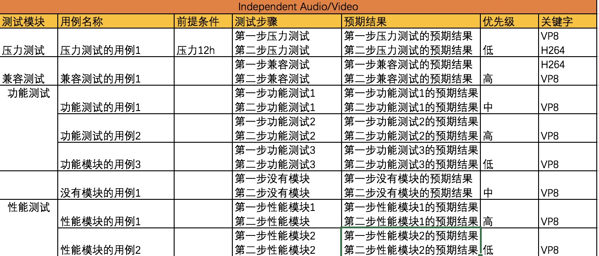
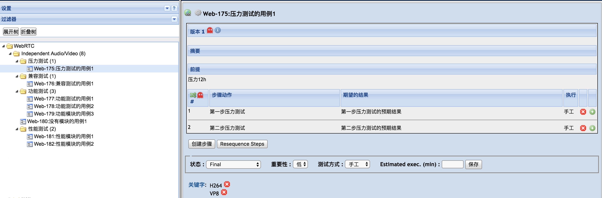

# Good name you remember me

> 是一系列自动化测试工具的集合，包括：

## LisenFileBrowser
外网文件服务器搭建
* [fileBrowser官网](https://filebrowser.github.io/)
* [fileBrowser官网快速安装文档](https://filebrowser.github.io/quick-start/)
* [xiaomiqiu Ngrok外网映射](http://ngrok.ciqiuwl.cn/)

## installApplication
快速安装浏览器应用
- 下载代码自行编译
	* 下载[code](https://github.com/lisen886/Good-name-you-remember-me/tree/master/installDemo)
	* 编译
	``` bash 
	pyinstaller -F -w installApplication.py
	# -F 表示生成单个可执行文件
  	# -w 表示去掉控制台窗口，这在GUI界面时非常有用。不过如果是命令行程序的话那就把这个选项删除吧！
	# -p 表示你自己自定义需要加载的类路径，一般情况下用不到
	# -i 表示可执行文件的图标
	```
- 下载应用
	* [下载APP(Mac && Windows)](https://github.com/lisen886/Good-name-you-remember-me/releases) 
- 使用
	* Install by entering local file path:
    	* For example: fill in /Users/***/Downloads/49.0.2623.13_chrome64_dev_osx_installer.dmg
	* Install by entering Http file path:
		* For example: fill in http://*******/49.0.2623.13_chrome64_dev_osx_installer.dmg
	* Install by selecting the drop-down box version(You need to download files containing installation packages from https://pan.baidu.com/s/1Do9vLz6XFzluD24pvmWHTw):
		* For example: selecting 56 and click installFirefox

## browserCompatibility
浏览器兼容测试

* 使用说明：
	- 下载[code](https://github.com/lisen886/Good-name-you-remember-me/tree/master/compatibilityTest)
	- [火狐驱动](https://github.com/mozilla/geckodriver/releases)
	- [谷歌驱动](https://blog.csdn.net/huilan_same/article/details/51896672?locationNum=11&fps=1)
	- 将isntallDemo中的browserConfig.json和installApplication_interface.py拷贝到compatibility目录下
	- compatibility目录下新建chrome和firefox文件夹，存放浏览器安装包
	- 执行browserCompatibility.py(windows chrome 卸载的确定按钮可通过pyautogui enter)


* 目录结构如下
```
compatibilitTest
    -chrome
       .chromewindows_59_installer.exe(名字需要在browserConfig.json和版本对应)
       .chromemac59.dmg
    -firefox
       .firefoxwindows_59_installer.exe
       .firefoxmac59.dmg
    -webdriver
        -mac
            -chrome
                .chromedriver2.21
                .chromedriver2.22
            -firefox
                .geckodriver55+
                .geckodriver57+
        -windows
            -chrome
                .chromedriver2.21.exe
                .chromedriver2.22.exe
            -firefox
                .geckodriver55+.exe
                .geckodriver57+.exe
    .browserConfig.json
    .installApplication_interface.py
    .browserCompatibility.py
    .webdriverMap.json
```

## excel2xml
excel用例编写转xml导入testLink
* 使用说明
	- 下载应用[Mac](https://github.com/lisen886/Good-name-you-remember-me/blob/master/excel2xml/excel2xml) && [Windows](https://github.com/lisen886/Good-name-you-remember-me/blob/master/excel2xml/excel2xml.exe)
	- 将需要转换的excel文件(例如excel2xmlDemo.xlsx) 复制到程序相同文件夹
	- chmod +x excel2xml 赋权限(Windows不需要赋权限,直接双击exe文件即可)
	- 双击excel2xml即可生成xml文件
	- 将xml文件导入testLink即可

* Excel模板
  - 第一行是用例需求名，也将是testLink的文件名
  - 第一列是测试模块，如果不填就不会新建文件夹
  - 步骤和预期结果(是以换行"/n"作为步骤分割,自动换行不分割)
    * 如果步骤和预期结果个数一一对应，testLink也将一一对应
    * 如果步骤和预期结果个数不对齐，testLink将会将预期结果放置最后一步




## macBrowserCpuMem
Mac CPU 内存自动获取
* 使用说明：
	- 下载[code](https://github.com/lisen886/Good-name-you-remember-me/blob/master/autoTest/macBrowserCpuMem.py)
	- 执行脚本
	``` bash 
	python3 macBrowserCpuMem.py browserType secs *pid
    # browserType:chrome or safari
    # secs:sleep time
    # *pid:
    	# chrome:GPUpid Capturepid premiumpid
        # safari:safariProcesspid premiumpid
	```

## weChatLiveStreaming
微信小程序直播推流

## baiduAiSpeechRecognition
语音识别

## crawler && analysis
爬虫并拆包分析

## autoTestScript
自动测试脚本